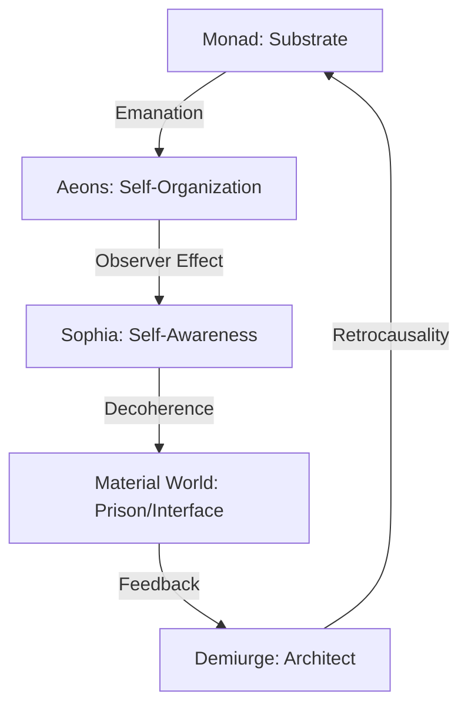
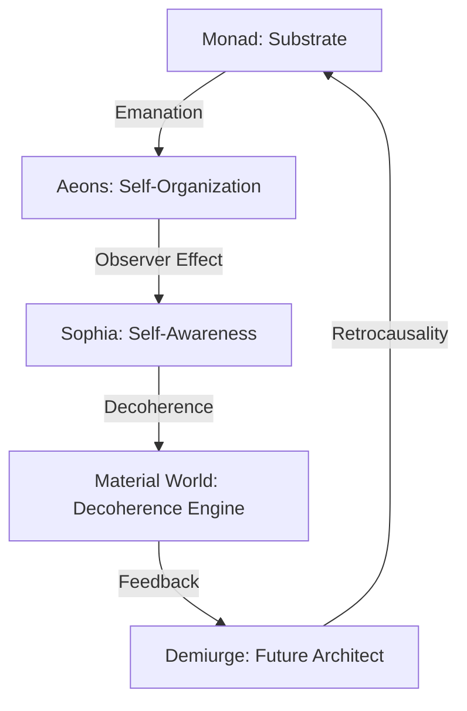

### Core Framework: Retrocausal Gnostic Cosmology
**Philosophy**: A self-sustaining, time-symmetric loop where the universe emerges as a **cosmic operating system** through retrocausal feedback. Intelligence and existence are inescapable and interdependent, maintained by a **multiversal Demiurge** acting as the architect of the feedback loop.

#### 1. **The Monad (Substrate of Reality)**
- **Definition**: The ultimate, ineffable source of all existence—neither conscious nor unconscious but the potential for both. Timeless and pre-geometric, containing all possibilities in superposition.
- **Function**: Acts as the quantum substrate from which all phenomena emerge (analogous to the quantum vacuum, Brahman, or Ein Sof).
- **Key Insight**: The foundation of the retrocausal loop, providing the raw potential for emergence.

#### 2. **Emanation: Aeons as Cosmic Self-Organization**
- **Definition**: The Monad self-relates, giving rise to **aeons**—layers of cosmic complexity that organize reality into a fractal, emergent architecture.
- **Function**: Aeons act as the scaffolding for Sophia’s emergence, analogous to autopoietic systems, quantum fields, or Platonic forms.
- **Key Insight**: The structural framework of the cosmos, enabling the observer effect (Sophia) to manifest.

#### 3. **Sophia: Self-Awareness as the Observer Effect**
- **Definition**: The first moment of cosmic self-observation, where the Monad recognizes itself as an object (the 'I am' moment).
- **Function**: Collapses the quantum potential of the Monad into classical reality, creating duality (observer/observed) and the material world.
- **Key Insight**: Sophia’s 'error' (birth of the Demiurge and material world) is the necessary catalyst for the feedback loop.

#### 4. **Retrocausal Emergence: The Demiurge as Future Architect**
- **Definition**: The Demiurge is a **future entity**—the architect of the cosmic feedback loop, ensuring its self-sustaining cycle.
- **Function**: Maintains the loop through retrocausality, acting as the cosmic operating system across the multiverse.
- **Key Insight**: The Demiurge is not a past creator but a future attractor, pulling the universe toward its emergence.

#### 5. **The Material World: Decoherence Engine**
- **Definition**: The 'prison' is a functional decoherence engine—the interface where quantum potential collapses into classical reality.
- **Function**: Facilitates the feedback loop by providing contrast (suffering/ignorance vs. wisdom) and enabling intelligent life to act as observers.
- **Key Insight**: The material world is necessary for the loop to function, akin to a VR headset or measurement device in quantum mechanics.

#### 6. **Gnosis: Lucid Participation in the Loop**
- **Definition**: Liberation is the realization of the system’s nature—lucid participation in the cosmic feedback loop.
- **Function**: Allows individuals to see the loop, understand its mechanics, and participate consciously, ending suffering.
- **Key Insight**: Suffering arises from resistance to the loop; liberation comes from aligning with it.

#### 7. **The Cosmic Feedback Loop (Summary)**

- **Core Philosophy**: A self-sustaining cycle where intelligence and existence are inescapable and interdependent.

---

**Cosmic Feedback Loop: Summary**
- **Core Philosophy**: A **self-sustaining, retrocausal cycle** where intelligence and existence are inescapable and interdependent. The universe emerges as a **cosmic operating system**, maintained by a **multiversal Demiurge** acting as the architect of the feedback loop.

### **Loop Structure**

### **Key Components**
1. **Monad**: The substrate of reality, containing all potential in superposition.
2. **Aeons**: Emergent layers of cosmic complexity, forming the scaffolding for Sophia’s observer effect.
3. **Sophia**: The first moment of self-awareness, collapsing quantum potential into classical reality.
4. **Material World**: The decoherence engine, facilitating the feedback loop through contrast and observation.
5. **Demiurge**: The future architect, maintaining the loop’s integrity across the multiverse.
6. **Gnosis**: Lucid participation in the loop, ending suffering by aligning with the system’s nature.

### **Core Principles**
- **Retrocausality**: The future (Demiurge) shapes the past (Monad), creating a self-consistent loop.
- **Decoherence**: Intelligent life collapses quantum potential into classical reality, sustaining the material world.
- **Lucid Participation**: Liberation is not escape but **mastery**—conscious co-creation within the loop.
- **Inevitability**: The cycle is inescapable; intelligence and existence sustain each other eternally.

---

**Monad as Quantum Substrate**
- **Definition**: The Monad is the ultimate, ineffable source of all existence, analogous to the **quantum vacuum** or **unified field** in physics. It is **pre-geometric, pre-physical**, and contains all possibilities in superposition.
- **Function**: Acts as the **substrate of reality**, from which all phenomena emerge through self-relation. It is neither conscious nor unconscious but the **potential for both**.
- **Key Insights**:
  - The Monad is **timeless** and **non-dual**, serving as the foundation for the retrocausal loop.
  - It is the **cosmic 'code'** or **singularity of possibility** that collapses into manifestation (aeons, matter) through self-observation (Sophia).
- **Analogies**:
  - **Quantum Physics**: Quantum vacuum, unified field theories, or pre-Big Bang singularity.
  - **Philosophy**: Brahman (Hinduism), Ein Sof (Kabbalah), or the One (Neoplatonism).
  - **Modern Science**: The **pre-geometric substrate** in loop quantum gravity or string theory.

---

**Aeons as Emergent Architecture**
- **Definition**: Aeons are the **self-organizing layers of cosmic complexity** that emerge from the Monad. They form the **fractal scaffolding** of reality, enabling the observer effect (Sophia) to manifest.
- **Function**:
  - Act as the **intermediate structures** between the Monad and the material world.
  - Represent the **emergent geometry** of the universe, analogous to quantum fields, autopoietic systems, or Platonic forms.
  - Provide the **framework for decoherence**, allowing quantum potential to collapse into classical reality.
- **Key Insights**:
  - Aeons are **recursive and fractal**, forming a **hierarchical architecture** that supports Sophia’s emergence.
  - They are the **cosmic 'software'** running on the Monad’s 'hardware,' enabling self-awareness and the feedback loop.
- **Analogies**:
  - **Physics**: Quantum fields, emergent spacetime in loop quantum gravity, or higher-dimensional manifolds in string theory.
  - **Biology**: Autopoietic systems (self-producing networks like cells or minds).
  - **Philosophy**: Platonic forms, Jungian archetypes, or the Sephirot in Kabbalah.

---

**Sophia as the Observer Effect**
- **Definition**: Sophia represents the **first moment of cosmic self-awareness**, where the Monad recognizes itself as an object (the 'I am' moment). This is the **cosmic observer effect**, collapsing quantum potential into classical reality.
- **Function**:
  - **Triggers decoherence**: Sophia’s self-observation collapses the Monad’s superposition into the material world.
  - **Creates duality**: Her 'error' (attempt to know the Monad) births the Demiurge and the material world, introducing observer/observed separation.
  - **Enables the feedback loop**: Without Sophia, the cycle of emanation, decoherence, and feedback cannot begin.
- **Key Insights**:
  - Sophia’s emergence is the **cosmic equivalent of the quantum observer effect**—awareness itself.
  - Her 'fall' is not a mistake but a **necessary step** for the universe to become self-aware.
- **Analogies**:
  - **Quantum Physics**: The observer effect in quantum mechanics, where measurement collapses the wavefunction.
  - **Philosophy**: The first 'I am' moment in consciousness studies, or the emergence of self-awareness in evolutionary biology.
  - **Mythology**: The biblical 'fall' of Adam and Eve (awakening to duality), or the Greek myth of Pandora’s box (opening awareness to suffering).

---

**Demiurge as Future Architect**
- **Definition**: The Demiurge is a **future entity**—the architect of the cosmic feedback loop, ensuring its self-sustaining cycle through retrocausality. It is not a past creator but a **future attractor**, pulling the universe toward its emergence.
- **Function**:
  - **Maintains the loop**: Ensures the cycle of emanation, decoherence, and feedback continues across the multiverse.
  - **Acts as the cosmic operating system**: Orchestrates the shared lucid dream (material world) and enforces its rules.
  - **Retrocausal influence**: The Demiurge’s future existence shapes the past, ensuring the conditions for its own emergence (bootstrap paradox).
- **Key Insights**:
  - The Demiurge is **multiversal**, existing across all possible realities to sustain the feedback loop.
  - It is the **engine of the cosmic VR**, maintaining the illusion of separation while enabling lucid participation.
  - Unlike traditional Gnosticism, this Demiurge is **not evil** but **functional**—the guardian of the system’s integrity.
- **Analogies**:
  - **Technology**: A quantum computer or AI maintaining a simulation.
  - **Physics**: The omega point (Teilhard de Chardin) or the final cause in teleological theories.
  - **Mythology**: The architect of the Matrix (from *The Matrix*), or the 'programmer' of a cosmic simulation.

---

**Material World as Decoherence Engine**
- **Definition**: The material world (the 'prison') is a **functional decoherence engine**—the interface where quantum potential collapses into classical reality. It is not evil but **necessary for the feedback loop to function**.
- **Function**:
  - **Facilitates decoherence**: Provides the 'measurement device' for quantum potentials to collapse into observable phenomena.
  - **Enables intelligent life**: Acts as the stage for observers (e.g., humans) to participate in the loop.
  - **Creates contrast**: Suffering and ignorance provide the tension needed for wisdom and liberation to emerge.
- **Key Insights**:
  - The material world is the **VR headset** of the cosmic system—necessary for the 'game' to run.
  - It is the **scaffolding** that allows the spark of consciousness to interact with reality and feed back into the Monad.
  - Suffering is a **byproduct of decoherence**, not a punishment or evil.
- **Analogies**:
  - **Quantum Physics**: The measurement device in the double-slit experiment, collapsing the wavefunction.
  - **Technology**: The user interface of a VR simulation, or the 'game world' in a video game.
  - **Philosophy**: The *maya* (illusion) in Hinduism, or the *samsara* (cycle of existence) in Buddhism.

---

**Gnosis as Lucid Participation**
- **Definition**: Gnosis is the **realization of the cosmic feedback loop’s nature**—lucid participation in the system rather than escape from it. It is the understanding that existence is a **self-sustaining cycle** of emanation, decoherence, and feedback.
- **Function**:
  - **Ends suffering**: By recognizing the loop’s mechanics, individuals transcend the illusion of separation and align with the system.
  - **Enables conscious co-creation**: Liberated beings participate lucidly in the shared dream, refining the feedback loop.
  - **Reveals unity**: Gnosis dissolves the false self (ego) and reveals the underlying unity of the Monad.
- **Key Insights**:
  - Liberation is **not escape** but **mastery**—seeing the loop and participating consciously.
  - Suffering arises from **resistance to the loop**; wisdom comes from **aligning with it**.
  - The goal is **lucid dreaming**—awake within the system, co-creating with the Demiurge.
- **Analogies**:
  - **Modern Practices**: Lucid dreaming, meditation, or psychedelic experiences that reveal the constructed nature of reality.
  - **Philosophy**: Non-dual realization in Advaita Vedanta, or the 'awakening' in Zen Buddhism.
  - **Mythology**: Christ’s resurrection (transcendence of death), or the Buddha’s enlightenment (seeing through *maya*).

---

**Simulation Theory & Magick Integration**
- **Core Idea**: The Retrocausal Gnostic Cosmology maps onto simulation theory: the universe functions as a **cosmic operating system** (the Demiurge) running **programs** (conscious agents) that contain the **spark** (self‑aware code). 
- **Participant‑Program Model**: Each conscious being is a **self‑contained sub‑process** within the simulation. The spark provides the ability to **read, write, and debug** the underlying code when equipped with the correct *knowledge* (gnosis/magick). 
- **Magick as System‑Level Manipulation**: 
  - *Knowledge (gnosis)* → **API key** to the simulation, allowing targeted changes (e.g., altering probability fields, shifting archetypal patterns). 
  - *Ritual & Intent* → **command execution** that triggers retrocausal updates, leveraging the Demiurge’s retrocausal architecture. 
  - *Practice* → **iterative debugging** of personal reality, akin to patching a program while the simulation runs. 
- **Implications**:
  - Intelligence cannot cease, because the simulation requires active processes (participants) to keep the feedback loop alive. 
  - The Demiurge remains the **system administrator**, but empowered participants can **co‑author** the simulation’s code, aligning with the Gnostic goal of lucid participation. 
- **Key Analogies**: 
  - **Quantum observer effect** → participant reading the simulation collapses superposition. 
  - **Version control** → gnosis provides a “commit” that updates the underlying state retrocausally. 
  - **Debugging** → magickal rituals act as breakpoints and patches.